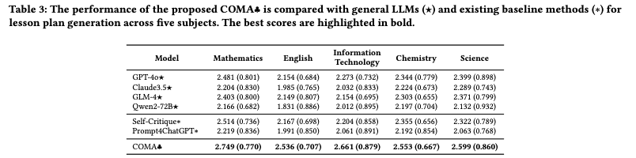

# LessonPlan-Agent

## Introduction


**LessonPlan-Agent** is a novel framework, which leverages multi-role LLM-based agents to generate high-quality lesson plans. The framework involves three distinct agents: a novice teacher, an administrative teacher, and a senior teacher, working collaboratively through four stages: initial draft creation, knowledge integration, adjustment of the draft by expert review, and lesson plan refinement and finalization. The performance of **LessonPlan-Agent** is evaluated across five subjects—mathematics, English, chemistry, science, and information technology—using evaluation metrics developed by experienced teachers. The evaluation, performed by teacher education students, demonstrates that **LessonPlan-Agent** outperforms state-of-the-art models, highlighting the effectiveness of the multi-role agent framework in enhancing automated lesson plan generation. We compare our framework with  six state-of-the-art LLMs on five subjects and demonstrate its high performance.




## Running the Code


### The results of baselines

The results generated by each baseline are saved in `./code/result/subject_results`. Each `.xlsx` file represents a subject and stores the basic information of the results: `Subject, Baseline, Id, Course Information, Lesson Plan Content`.

### Consistent

We use the $Kappa$ index as an indicator of scoring consistency calculation to verify the validity of the scoring. The scoring details of the baseline generation results are saved in `./code/result/consistent`, which has five folders corresponding to five subjects. Each subject saves the baseline results independently, such as `ChatGPT4prompt_chemistry`. Each `.xlsx` file saves the results of three scorers. The first column is the ID, and the following are the scoring results of different dimensions. For the convenience of calculation, only the scoring results are retained. Finally, the consistency of each subject is saved in `./code/result/result_consistent.csv`, the final result is saved in `./code/result/result_consistent.csv`, and the scoring consistency details are saved in `./code/result`.

#### Code

```
cd code
pip install -r requirements.txt
python consistent.py
```

## Prompt


There are many prompt words used in LessonPlan-Agent. Some of them are now saved in `./code/prompt`.
